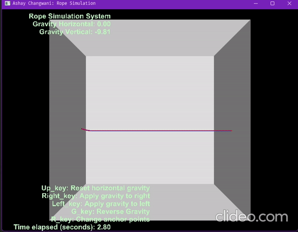
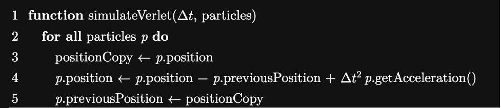
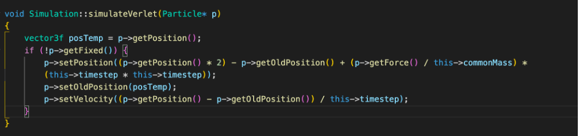
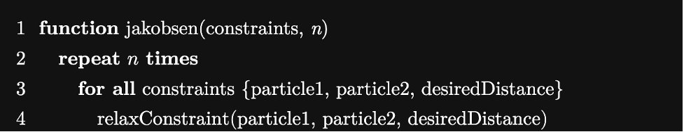
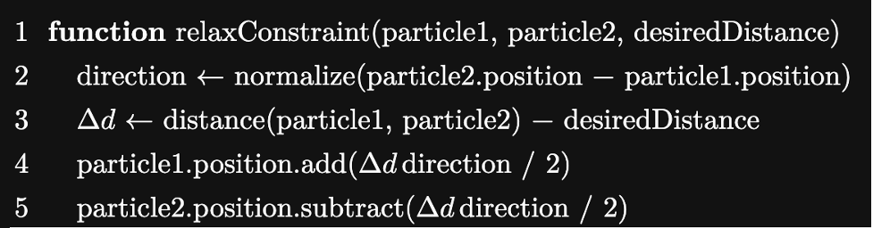
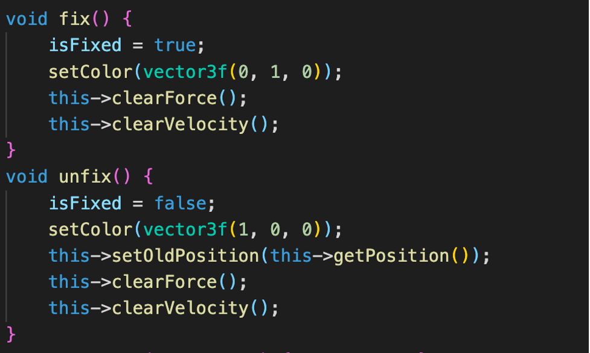
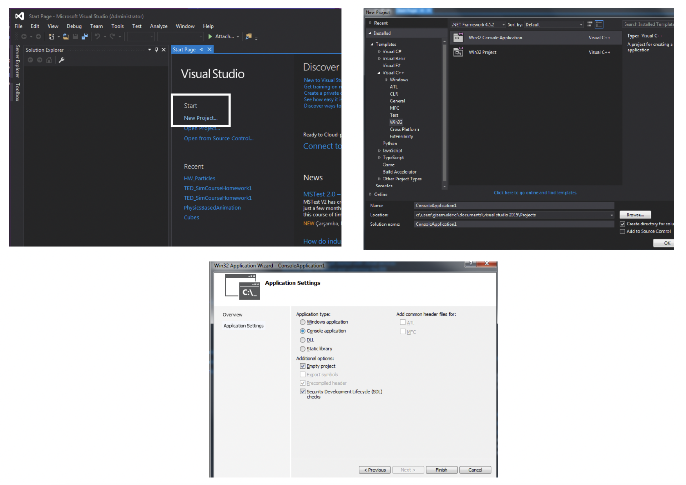
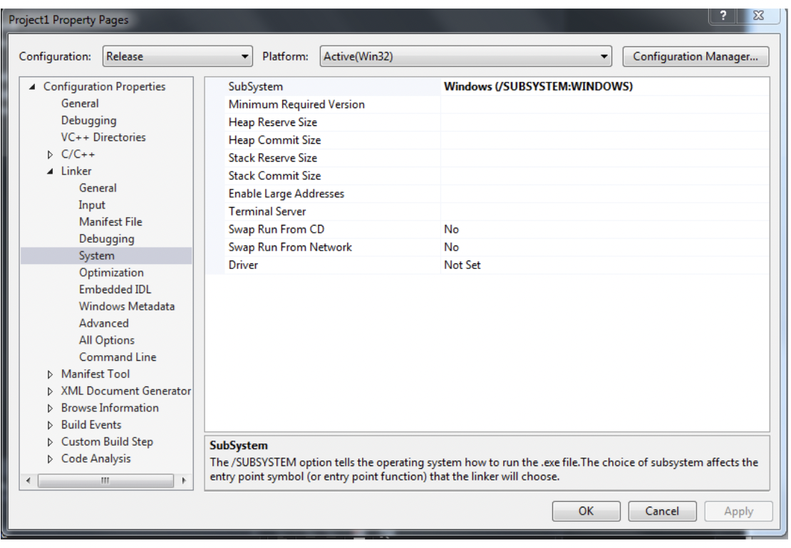

# **Rope Simulator:**

**Ashay Changwani**
___
For this project, I will create a 2D rope simulator.

In order to visualize the physics, we will create controls for changing anchor points and for changing the gravity acting in the system.

First, to create the rope, we will create a mesh of particles in a straight line as the starting point. Each of the successive points will be connected by a spring.

We define the length of the spring as Simulation-\&gt;distance attribute. The rope physics will be modified to ensure that the length of the spring stays constant.

However, we will not be using the spring force component of the optional assignment. We are simply using the springs to connect the particles to create a rope visualization.

In order to do the integration, we will be using Verlet integration so that the order of magnitude of the error is as high as possible, and hence the integration will be more accurate than Euler or Euler Cromer methods.

The pseudocode for the Verlet integration is:

In this integration, we are operating independent of the velocity, we simply need to track the previous position. This way, the calculation doesn&#39;t depend only on the previous velocity, it depends on the average of the velocity over the last timestep.

We can then compute the velocity of a particle as the division of the distance between oldPosition and currentPosition divided by the timestep.

In terms of code, we do that in the following way:

We set the length of each spring as a constraint. At each iteration, we must enforce these constraints to prevent the rope segment from elongating beyond the length it is supposed to.

In order to enforce the constraints, we use the [Jakobsen Method](https://www.cs.cmu.edu/afs/cs/academic/class/15462-s13/www/lec_slides/Jakobsen.pdf).

At each iteration, we consider each spring and measure the current distance vs the expected distance. We then compute a delta which represents the difference between the two distances.

We must then offset the particles (edges of the rope segment) based on the offset.

We offset the segments by (delta/2) where we keep recomputing delta at each iteration.

This means, that we are essentially changing the total offset as:

Where n is the total distance between the current and expected distance.

We can see that if we execute for infinite iterations, eventually the constraints will be satisfied. However, that is not computationally feasible, hence we execute it for Simulation-\&gt;numRelax number of times. This approximates quite well the segment offset, even though it has a minor margin of error.

Where the relaxConstraint function as per the paper on Jakobsen Method is:

Now that the physics simulations are complete, we add some features to the visualization to better represent the computation.

We will add the following functions:

1. Change Anchor Points
2. Reverse Gravity
3. Apply Gravity to Left side
4. Apply Gravity to Right side
5. Reset Horizontal Gravity

1. Change Anchor Points

We set a few particles of the rope to be fixed. This means that those particles do not have gravity acting on them and do not move. This helps demonstrate the simulation even better.

We create these functions in particle.h so that we can fix and unfix particles that we select.

By default, only the first particle of the rope is fixed, the rest are free to move.

However, with this function, we unfix all particles in the rope. Then, we choose 2 particles and random and fix them.

1. Reverse Gravity

To perform this function, we multiply each component of the gravity vector by -1 and hence reverse it.

1. Apply Gravity to Left Side

When the corresponding key is pressed, we set the X component of the gravity vector as -9.81f.

1. Apply Gravity to Right Side

Same as function 3, however, we change the X component to 9.81f.

1. Reset Horizontal Gravity

When the corresponding key is pressed, we set the X component of the gravity vector as 0.0f.

# OPENGL	SETUP

- Download shared files
- Create a new folder, e.g. GL_Folder, to put the content ( glew and freeglut)
- Create an empty C++ project in Visual studio (see below).

- Right click Project &rarr; Properties &rarr;Configuration Properties &rarr; VC++ Directories &rarr;Include Directories:
    Select **_Include_** folders of both glew and freeglut
- Configuration Properties &rarr; Linker &rarr; Input:
    Additional Dependencies:
    Write: **_glew32.lib_** and **_freeglut.lib_**
- Configuration Properties &rarr; Linker &rarr; General:
    Additional Library Directories:
    Select **_lib_** folders of both glew and freeglut
- Copy **_glew32.dll_** and **_freeglut.dll_** from GL_Folder and paste them to your project folder

`
Be sure that your subsystem is Windows:
`

`
And your character set is set to: Not Set
`

